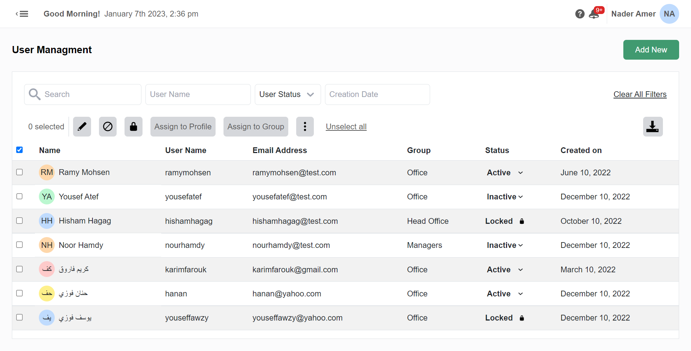
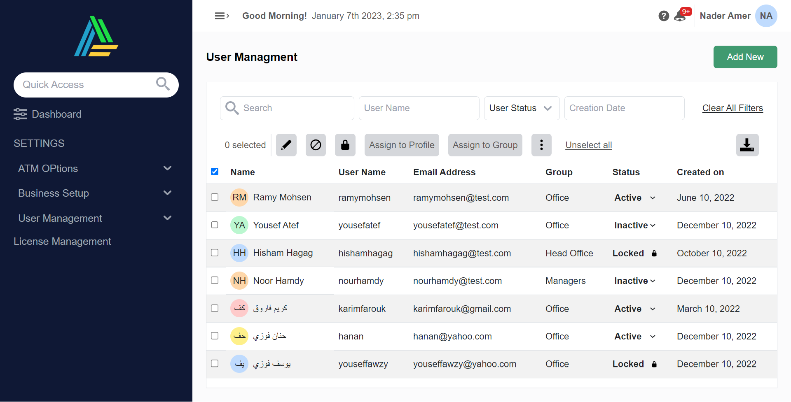
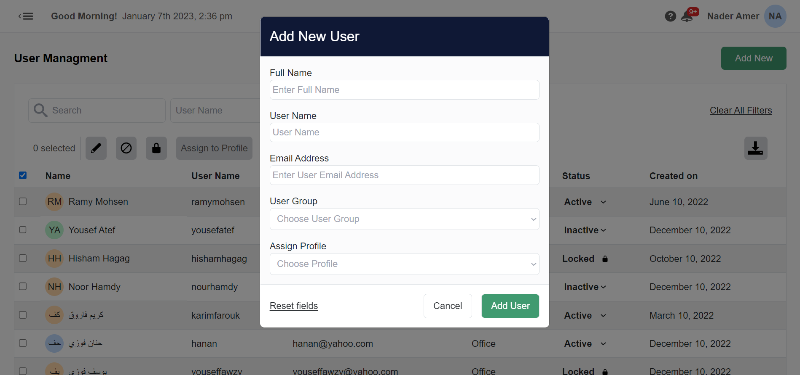

# Reno Systems Dashboard.

## 🏁 Get Started

### Installation

1. **_Clone the repository_**

```sh
git clone https://github.com/YousefElshabrawy/Reno-Systems-Dashboard.git
```

2. **_Navigate to repository directory_**

```sh
$ cd Reno-Systems-Dashboard
```

3. **_Install dependencies_**

```sh
$ npm install
```

### Running

1. **_Run the Mock Server_**

```sh
$ npm run server
```

2. **_Run the Client_**

```sh
$ npm run client
```

## 📷 Screenshots





## 🎥 Demo Video

https://user-images.githubusercontent.com/62210671/211152018-b491a6fa-1e2e-4b7e-9b1b-2ee525483010.mp4
